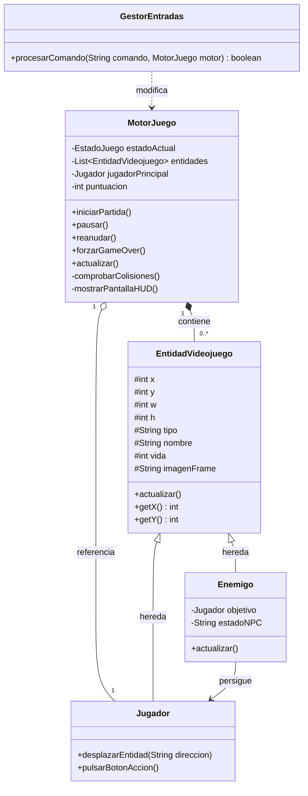
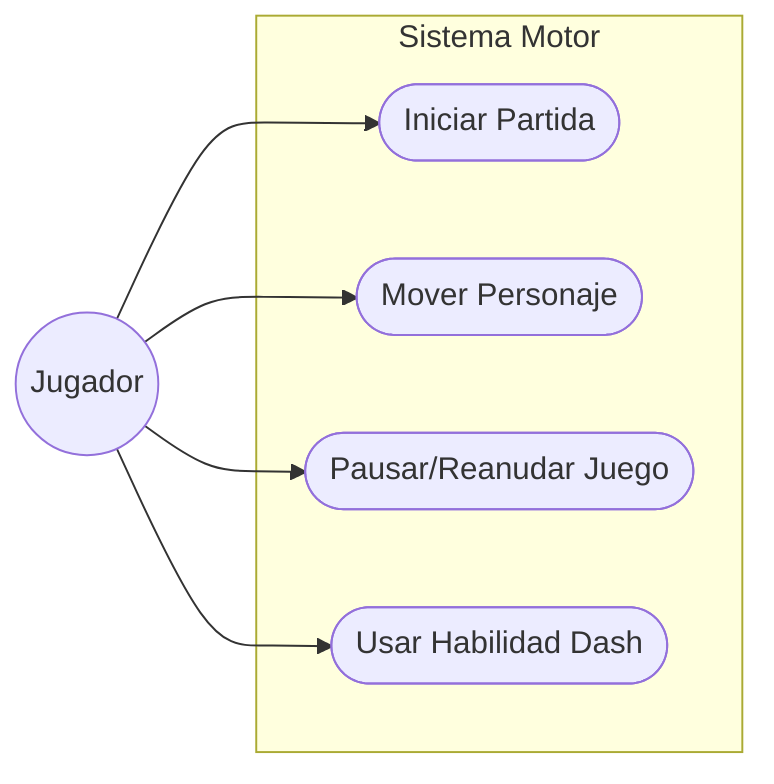

# Console-Man: Simulador de Motor de Videojuego Textual

## 1. Título y Temática Elegida
El proyecto **Console-Man** es una simulación de un motor de videojuego textual inspirada en el clásico *Pac-Man*. El objetivo es simular el comportamiento matemático y lógico de un jugador, sus enemigos y objetos recolectables mediante la consola, validando desplazamientos, cálculo de distancias para el comportamiento autónomo de los enemigos y detección de colisiones mediante coordenadas bidimensionales (x, y), todo sin necesidad de una interfaz gráfica compleja.

### 1.1. Guía de Ejecución: Cómo probar el juego
El juego funciona mediante un **bucle iterativo por turnos** a través de la consola estándar. Dado que no hay gráficos, el sistema imprime un "radar" en texto (HUD) indicando las coordenadas exactas de todos los actores en el tablero lógico.

**Objetivo:** Recoger los 2 premios (alcanzar 200 puntos) moviendo al jugador hacia las coordenadas de los objetos sin que el enemigo intercepte al jugador y agote sus 3 vidas.

**Instrucciones paso a paso para el evaluador:**
1. **Compilar:** En la raíz del proyecto, ejecuta `javac *.java`
2. **Ejecutar:** Arranca el simulador con `java Main`
3. **Flujo de comandos (Turnos):**
   * Escribe `INICIAR` y pulsa Enter para que el motor arranque la partida.
   * Observa las coordenadas del premio impresas en el "Radar" (ej. Premio en X:50, Y:45).
   * Desplaza al jugador escribiendo comandos de dirección: `ARRIBA`, `ABAJO`, `IZQUIERDA` o `DERECHA` y pulsando Enter. Cada movimiento simula un "frame" o turno del juego.
   * Escribe `ACCION` para usar una habilidad de desplazamiento rápido (Dash).
   * Escribe `PAUSAR` para comprobar que el motor bloquea los movimientos y `REANUDAR` para continuar.
   * Escribe `SALIR` en cualquier momento para terminar la simulación de forma segura. 
4. **Físicas y Enemigos:** En cada turno que el jugador se mueva, el enemigo evaluará automáticamente la distancia y se acercará. Si las coordenadas matemáticas de ambos coinciden (Colisión AABB), el jugador perderá una vida.

## 2. Arquitectura del Software
El sistema se ha diseñado con una restricción estricta de 6 clases para mantener una alta cohesión y bajo acoplamiento, cumpliendo con la rúbrica:
* **Main**: Punto de entrada de la aplicación. Instancia los objetos principales y arranca el bucle interactivo de la terminal pidiendo las entradas al usuario.
* **MotorJuego**: Clase central o "cerebro". Controla la máquina de estados del juego (Menú, Jugando, Pausa, Game Over, Victoria), almacena la colección de entidades y ejecuta el bucle lógico (Game Loop) y la comprobación de colisiones.
* **EntidadVideojuego**: Superclase que encapsula los atributos físicos (coordenadas `x`, `y`, tamaño `w`, `h`), vitales y visuales de cualquier objeto con presencia espacial en el juego.
* **Jugador**: Entidad jugable controlada por el usuario. Hereda de `EntidadVideojuego` e incorpora la lógica de simulación de movimiento táctil y habilidades.
* **Enemigo**: Entidad NPC autónoma. Hereda de `EntidadVideojuego` e implementa la lógica de seguimiento basada en el cálculo matemático de la distancia euclidiana respecto al jugador.
* **GestorEntradas**: Controlador intermediario que procesa los comandos introducidos por el usuario a través de la consola y los traduce en llamadas a métodos del motor o del jugador.

## 3. Diagrama de Clases UML

## 4. Diagrama de Casos de Uso UML

## 5. Especificación de Casos de Uso

| Campo | Descripción |
| :--- | :--- |
| **Nombre** | CU-01 Iniciar Partida |
| **Objetivo** | Que el motor cambie su estado de MENU a JUGANDO para comenzar el bucle iterativo y procesar las acciones de las entidades. |
| **Actor Principal** | Jugador |
| **Precondiciones** | El sistema debe estar en estado MENU y debe existir obligatoriamente una entidad `Jugador` instanciada y registrada en el `MotorJuego`. |
| **Flujo Principal** | 1. El actor introduce el comando "INICIAR" por la terminal. 2. El `GestorEntradas` lee y valida el texto introducido. 3. Se invoca el método `iniciarPartida()` del motor. 4. El estado del sistema pasa a `JUGANDO`. 5. Se muestra por consola el mensaje de que la partida ha iniciado. |
| **Flujos Alternativos** | Si no hay un jugador asignado al motor, el sistema lanza un mensaje de error y el estado del juego permanece inalterado en MENU. |
| **Postcondiciones** | El bucle de juego queda habilitado para procesar los métodos `actualizar()` en los turnos posteriores. |
| **Reglas de Negocio** | No se puede iniciar la partida si el estado actual es GAME_OVER, VICTORIA o si ya se está en estado JUGANDO. |

| Campo | Descripción |
| :--- | :--- |
| **Nombre** | CU-02 Mover Personaje |
| **Objetivo** | Modificar las coordenadas espaciales X o Y del jugador en la simulación matemática. |
| **Actor Principal** | Jugador |
| **Precondiciones** | El estado actual del motor debe ser obligatoriamente JUGANDO. |
| **Flujo Principal** | 1. El actor introduce una dirección válida (ej. "ARRIBA"). 2. `GestorEntradas` capta el comando y llama a `desplazarEntidad("ARRIBA")` del jugador. 3. El jugador resta 5 unidades a su coordenada Y. 4. Se actualiza internamente el nombre del frame de animación simulado. |
| **Flujos Alternativos** | Si se introduce un comando de movimiento pero el juego está en PAUSA, el gestor deniega el movimiento mostrando una advertencia. Si la dirección es ilegible, ignora el comando. |
| **Postcondiciones** | La posición del jugador en la matriz lógica se actualiza, lo que expondrá al personaje a una evaluación de colisión (premio o daño) en la fase final del turno. |
| **Reglas de Negocio** | El desplazamiento espacial debe hacerse en los ejes estrictos (X, Y) y con saltos numéricos predefinidos en la clase Jugador. |

## 6. Bitácora del Uso de Inteligencia Artificial (IA)

* **Herramienta utilizada y rol asignado:** Se ha utilizado Google Gemini con el rol de asistente experto en Java, Arquitectura de Software y UML.
* **Muestra de Prompts:**
  1. *"Estructura máxima permitida (Máx. 6 Clases): Main, MotorJuego, EntidadVideojuego, GestorEntradas [...] hazme las clases y el codigo entero con el control de errores y todos los requisitos que pide el profesor."*
  2. *"vale pero el codigo java quiero que las cosas se las pidas por la terminal al usuario no que automaticamente se haga todo. vuelve a generarme las clases teniendo esto en cuenta y documentadas con javadoc tambien y los requisitos del profesor."*
* **Control de Errores de la IA:** Durante la conceptualización de las físicas, la IA tendía de forma natural a aislar la funcionalidad matemática de interacciones creando una clase externa (ej. `GestorColisiones`). Esto suponía un error frente a los requisitos, ya que excedía la restricción máxima de 6 clases. Para solucionarlo, tuve que dar una directriz explícita para que refactorizara el código, moviendo la detección de colisiones de tipo *AABB* (Axis-Aligned Bounding Box) como un método privado interno de `MotorJuego` y evitar así crear clases extra.
* **Reflexión Crítica:** Programar un motor base asistido por una IA bajo presión de tiempo ofrece ventajas innegables: elimina casi por completo la fricción de escribir el "boilerplate" de las clases en Java y agiliza el cálculo matemático de lógicas abstractas, como la distancia euclidiana entre NPCs. Sin embargo, los peligros son notables. El código generado con IA para arquitecturas monolíticas como el "Game Loop" es un bloque altamente dependiente; si el estudiante no revisa detalladamente cómo interactúan los métodos en cascada, solucionar un simple error de estado (ej. moverse cuando el juego está pausado) puede volverse una tarea de depuración mucho más lenta y confusa que si lo hubiera escrito desde cero. Requiere ser meticuloso revisando las validaciones.